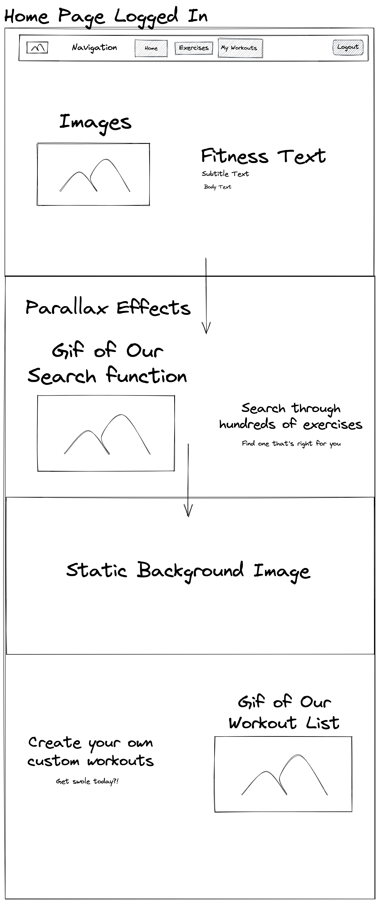
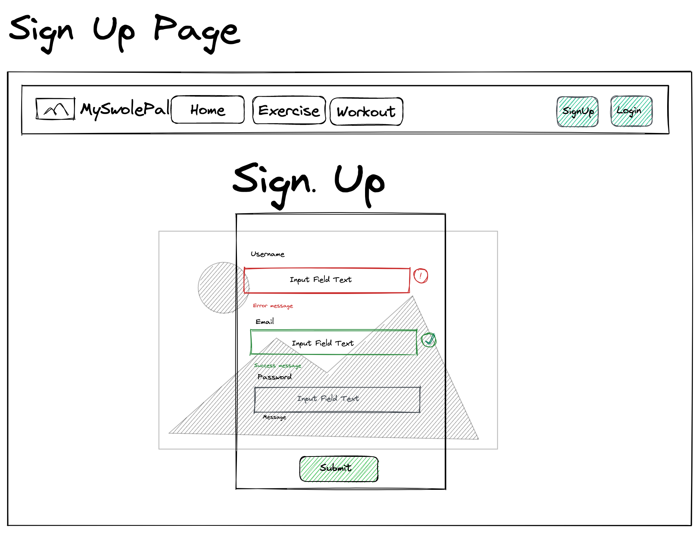
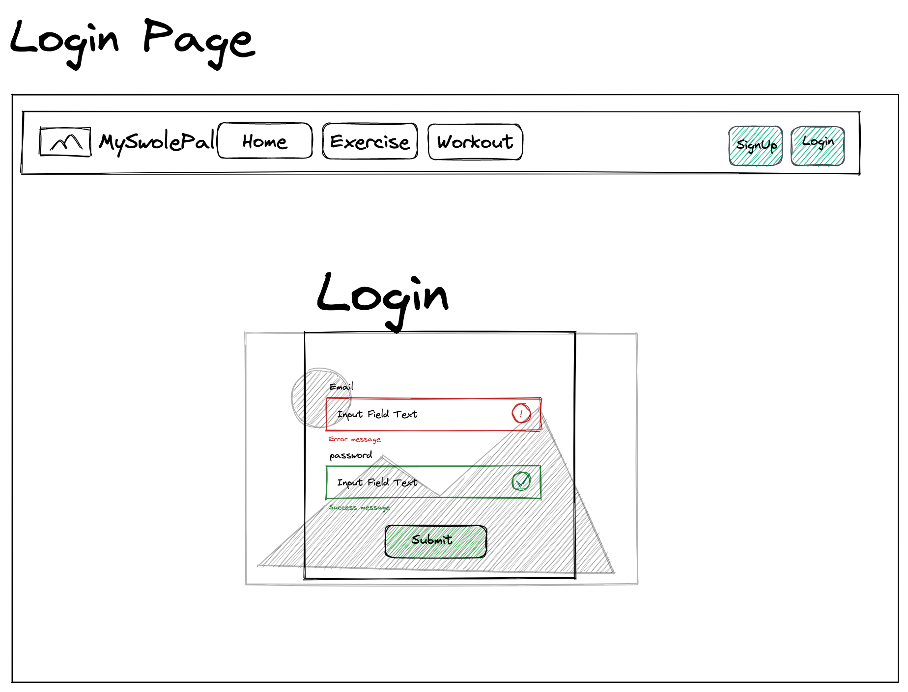
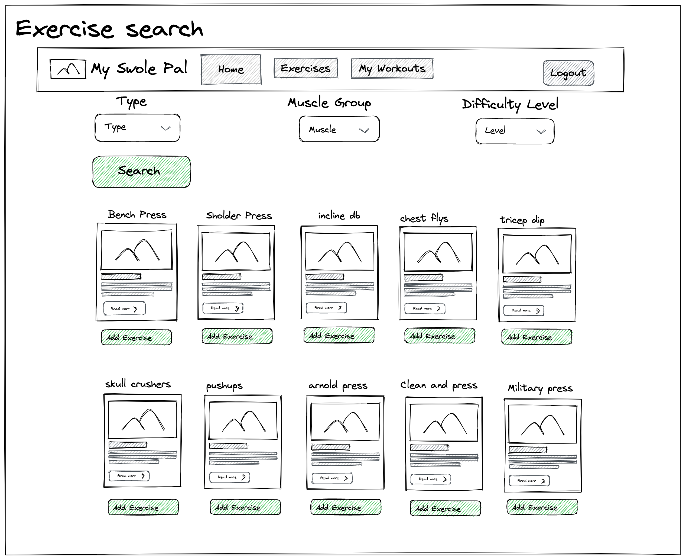
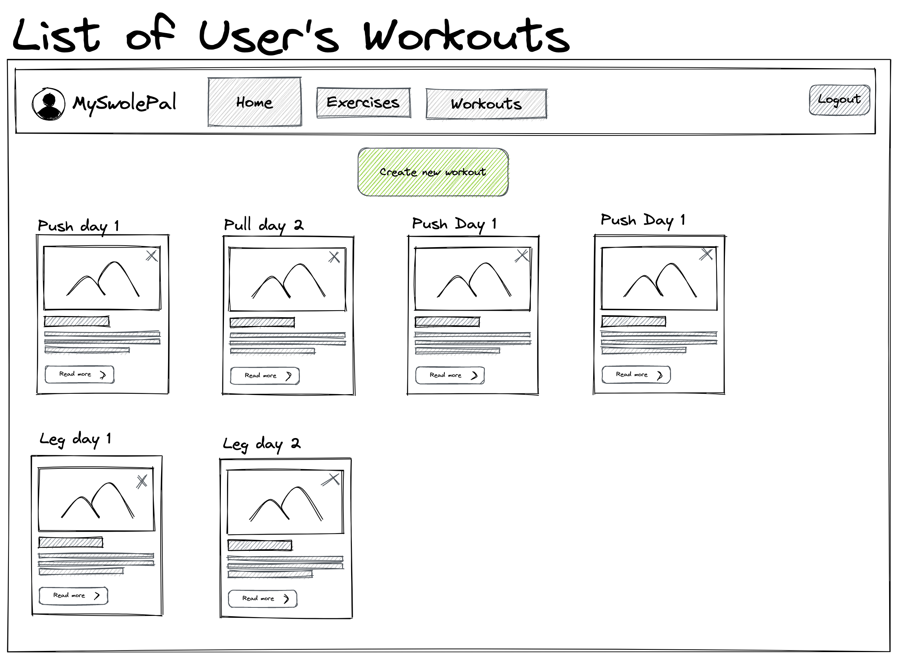
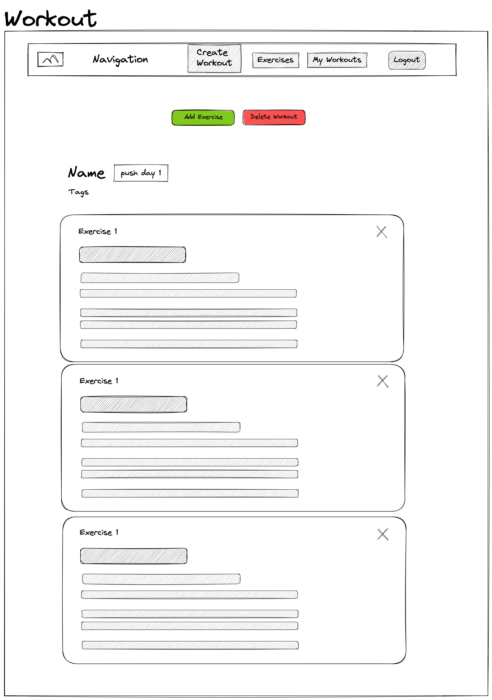

# Customer Graphical Human Interface

## Home Page
This will be the first page users will see after signing up or logging in.

## Sign Up Page
This is where users will be able to sign up.

## Login Page
This is where users will be able to login.

## Exercise Search Page
This is where users will be able to search for exercises based on type of activity, muscle group, and difficulty level.

## Workouts Page
This page holds the list of workouts  that will be created by the user.

## Workout View
This page will display the list of exercises that the user decided to include for any given workout.

